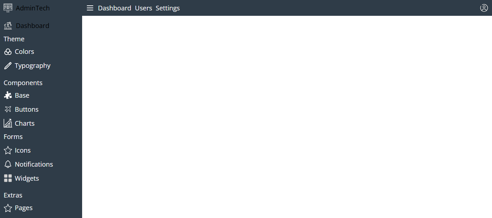

# Template Administrador

Este proyecto está licenciado bajo la Licencia ISC. Consulta el archivo [LICENSE](./LICENSE) para más detalles.


Este proyecto está actualmente en desarrollo. Nuevas características y mejoras se están implementando activamente.

## Descripción


> Este proyecto es un template administrativo completamente personalizable, diseñado para ayudar a desarrolladores y empresas a construir aplicaciones de gestión de datos de forma rápida y eficiente. Incluye una interfaz moderna y componentes esenciales como tablas de datos, gráficos, formularios y widgets, facilitando la creación de dashboards y sistemas administrativos adaptables a diferentes necesidades.

## Características

- Interfaz Moderna y Responsiva
- Componentes Reutilizables
- Dashboard Interactivo

## Tecnologías

- **Frontend:** HTML5, CSS3, JavaScript
- **Otros:** Sass, Gulp, Npm

## Instalación

### Prerrequisitos

1. Instalar [Node.js](https://nodejs.org/en/).

### Instrucciones

1. Clona el repositorio:

   ```bash
   git clone https://github.com/sebastianchinga/template-admin.git

2. Instala las dependencias con el comando 
    ```bash
    npm install

3. Se creará una carpeta build/

4. Abrir el archivo index.html en tu localhost

5. En caso deseas modificar el proyecto a tu gusto, ya sea colores, fuentes o imágenes (iconos), te recomiendo usar la carpeta src/ y para reflejar cambios, elimina la carpeta build/ y ejecuta el comando
    ```bash
    npm run dev

## Vista Previa


